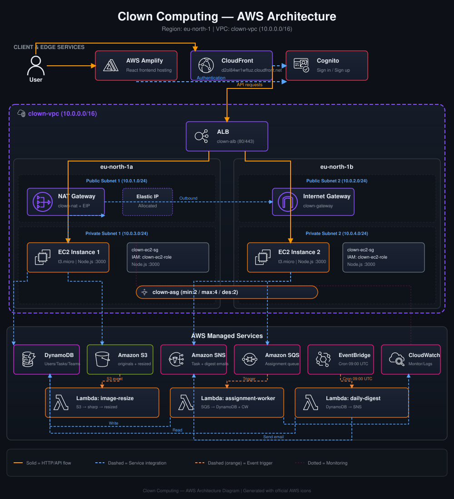

# Clown Computing — AWS Architecture

## Live Application
[https://d2ol84wr1wftuz.cloudfront.net](https://d2ol84wr1wftuz.cloudfront.net)

## Architecture Diagram

## High Availability Setup
- Multi-AZ deployment across eu-north-1a and eu-north-1b
- Auto Scaling Group (clown-asg) across two private subnets, min 2 / max 4 instances
- Application Load Balancer distributing traffic across both AZs
- NAT Gateway for outbound internet access from private subnets
- CloudFront CDN in front of ALB for caching and global distribution
- EC2 instances in private subnets, unreachable directly from the internet

## Team
Clown Computing — Mohamed Abdelsatar, Jessica Ehab, Donia Ali, Omar
